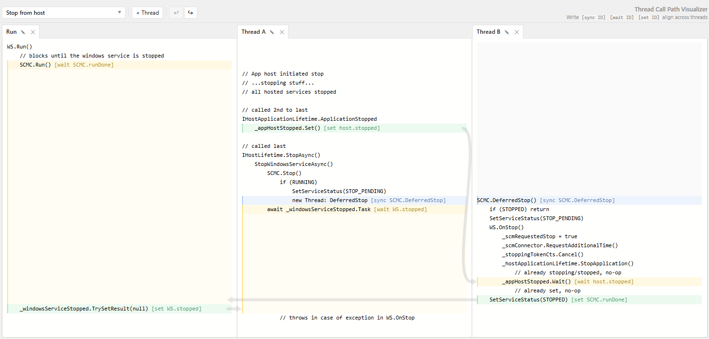

# Thread Call Path Visualizer

A web app for writing multi-threaded call flows side by side and aligning sync points in time.

https://qtax.github.io/thread-visualizer

**NOTE: Vibe coded without much code review.**




## Features

- Side-by-side thread code editors.
- Align `[sync ID]`, `[wait ID]`, and `[set ID]` markers across threads with visual connectors and cycle/deadlock detection.
- Add, reorder, rename, and remove threads.
- Workspaces - named groups of threads with easy switching.
- Unified undo/redo with Ctrl+Z/Y (persisted per workspace).
- Import/export workspaces.
- Auto-saves to localStorage.


## Development

### Prerequisite

- Node `24.15.0`.


### Run locally

```powershell
npm install
npm run dev
```


### Build

```powershell
npm run build
npm run preview
```


## Publish to GitHub Pages

This repository is configured to deploy to GitHub Pages from GitHub Actions.

1. Push to the default branch (`master` in this repository).
2. In GitHub, open `Settings -> Pages`.
3. Set `Source` to `GitHub Actions` if it is not already enabled.
4. Run/wait for the `Deploy to GitHub Pages` workflow to finish.
